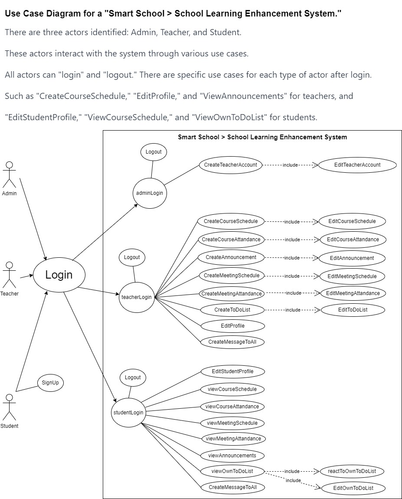

Smart School > School Learning Enhancement System
-------------------------
This project has been developed using Python programming language and PyQt5 library, culminating in an executable application. The application allows users to register or log in using their email and password.

User Types
--
The project encompasses the following three primary user types:

1. Admin

When logging into the application, the admin is recognized and directed to the admin panel. Here, the admin can create teacher accounts and make modifications to these accounts.

2. Teacher

Users logged in as teachers can access the teacher interface and perform functionalities as indicated in the diagram.

3. Student

Students can log in or create a new account. These users can modify their own personal to-do lists. Additionally, they have access to information created by their teachers.

Features
--------
-Each email address must be unique.

-Passwords should be eight characters long and include special characters.

-User data is stored in a JSON file.

